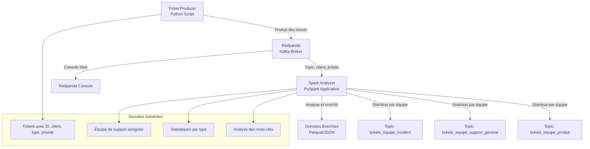

# Pipeline d'Analyse de Tickets avec Kafka et PySpark

Ce README explique le processus d'intégration de tickets, de répartitions de ceux-ci en fonction des différentes équipes de support associées à la tâche.

## Architecture du Pipeline



## Structure du Projet

```
Projet_9/
├── README.md                           # Documentation principale
├── docker-compose.yml                  # Orchestration Docker
├── requirements.txt                    # Dépendances Python
├── .gitignore                         # Fichiers à ignorer
│
├── src/                               # Code source principal
│   ├── producers/                     # Producteurs de données
│   │   └── ticket_producer.py         # Générateur de tickets
│   └── processors/                    # Processeurs de données
│       └── spark_analyzer.py          # Analyseur PySpark
│
├── config/                            # Configuration
│   └── spark/                         # Configuration Spark
│       └── spark-defaults.conf        # Paramètres Spark
│
├── docker/                            # Images Docker
│   ├── Dockerfile.ticket-producer     # Image du producteur
│   ├── Dockerfile.spark-analyzer      # Image de l'analyseur
│   └── scripts/                       # Scripts Docker
│       └── wait-for-kafka.sh          # Script d'attente Kafka
│
├── scripts/                           # Scripts d'exécution
│   ├── start.sh                       # Démarrage complet Docker
│   └── run_pipeline.sh                # Pipeline Python direct
│
├── stats/                             # Statistiques et insights générés
│
└── livrables/                         # Livrables du projet
    ├── rapport/                       # Rapport final
    ├── presentations/                 # Présentations
    └── schemas/                       # Schémas de données
```

## Installation et Démarrage

### Prérequis
- Docker et Docker Compose
- Python 3.11+
- Git

## Utilisation

### Accès aux Interfaces

- **Console Redpanda** : http://localhost:8080
  - Visualisation des topics et messages
  - Monitoring en temps réel
  - Gestion des schémas

- **Schema Registry** : http://localhost:18081
  - Gestion des schémas de données
  - Versioning et compatibilité

### Monitoring des Logs

```bash
# Logs Redpanda
docker-compose logs -f redpanda

# Logs de la console
docker-compose logs -f redpanda-console

# Logs d'un service spécifique
docker-compose logs -f [service_name]
```

### Accès aux Données

Les résultats d'analyse sont disponibles dans :

- **Fichiers locaux** : `stats/`
  - `tickets_enriched.parquet` : Données enrichies
  - `stats_by_type.parquet` : Statistiques par type
  - `word_frequency.parquet` : Fréquence des mots
  - `insights_summary.json` : Résumé complet

- **Topics Kafka** :
  - `client_tickets` : Topic source
  - `tickets_equipe_incident` : Tickets incidents
  - `tickets_equipe_support_general` : Tickets support
  - `tickets_equipe_produit` : Tickets produit

## Configuration

### Variables d'Environnement

```bash
# Kafka
KAFKA_BROKER=localhost:19092
TOPIC_NAME=client_tickets

# Spark
SPARK_MASTER=local[*]
SPARK_DRIVER_MEMORY=1g

# Application
LOG_LEVEL=INFO
BATCH_SIZE=1000
```

### Ports Utilisés

| Service | Port | Description |
|---------|------|-------------|
| Redpanda Console | 8080 | Interface web |
| Schema Registry | 18081 | Gestion des schémas |
| HTTP Proxy | 18082 | API REST |
| Kafka API | 19092 | Broker Kafka |
| Admin API | 19644 | API d'administration |

## Développement

### Structure du Code

Le code est organisé selon ces principes :

- **Séparation des responsabilités** : Chaque module a une responsabilité claire
- **Configuration externalisée** : Tous les paramètres sont configurables
- **Code modulaire** : Structure claire et extensible

### Ajout de Nouveaux Composants

1. **Nouveau producteur** : Ajouter dans `src/producers/`
2. **Nouveau processeur** : Ajouter dans `src/processors/`
3. **Nouvelle configuration** : Ajouter dans `config/`

### Tests

```bash
# Test de connectivité Kafka
python -c "from kafka import KafkaProducer; KafkaProducer(bootstrap_servers=['localhost:19092'])"

# Test de PySpark
python -c "from pyspark.sql import SparkSession; SparkSession.builder.getOrCreate()"
```

## Maintenance

### Sauvegarde des Données

```bash
# Sauvegarde des volumes
docker run --rm -v ticket-analysis-pipeline_redpanda-data:/data -v $(pwd):/backup alpine tar czf /backup/redpanda-backup.tar.gz -C /data .

# Sauvegarde des résultats
tar czf data-backup.tar.gz data/
```

### Nettoyage

```bash
# Arrêt des services
docker-compose down

# Suppression des volumes
docker-compose down -v

# Nettoyage complet
docker-compose down -v --rmi all
docker system prune -f
```